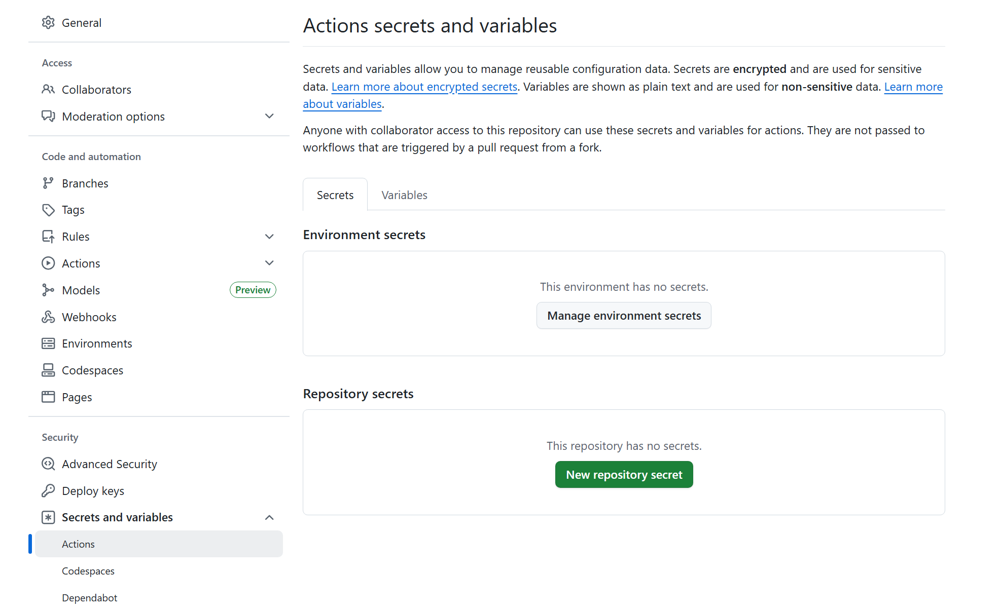
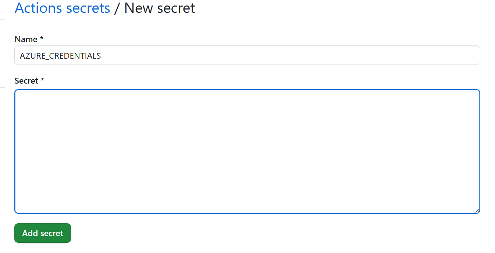
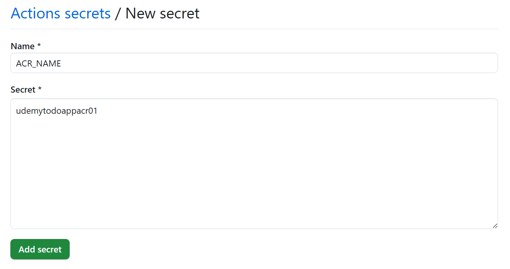
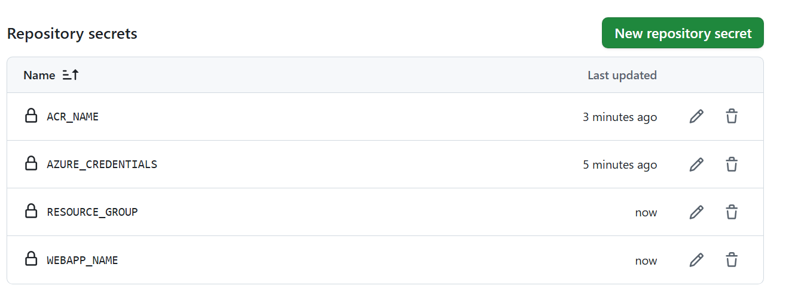

## サービスプリンシパル登録
Azure認証情報（サービスプリンシパル）の登録

```bash
az ad sp create-for-rbac --name "ToDoAppDeployAuth" --role contributor `
--scopes /subscriptions/f80766c9-6be7-43f9-8369-d492efceff1e/resourceGroups/rg-udemytodoappshrkm0708/providers/Microsoft.Web/sites/udemytodoappshrkm0708-app `
--json-auth
```

notify-serviceへの権限付与
```bash
az role assignment create `
  --assignee acc5fe33-5f8f-4fc3-816c-fda163023d71 `
  --role contributor `
  --scope /subscriptions/f80766c9-6be7-43f9-8369-d492efceff1e/resourceGroups/rg-udemytodoappshrkm0708/providers/Microsoft.Web/sites/udemytodoappshrkm0708-notify
```

ACR への AcrPush 権限付与
```bash
az role assignment create `
  --assignee acc5fe33-5f8f-4fc3-816c-fda163023d71 `
  --role AcrPush `
  --scope /subscriptions/f80766c9-6be7-43f9-8369-d492efceff1e/resourceGroups/rg-udemytodoappshrkm0708/providers/Microsoft.ContainerRegistry/registries/udemytodoappshrkm0708acr01
```


出力されるJSONをメモしておきます。


GitHub Secretsに登録


AZURE_CREDENTIALS



ACR_NAMEも登録
udemytodoappacr01



RESOURCE_GROUPも登録
rg-todo


